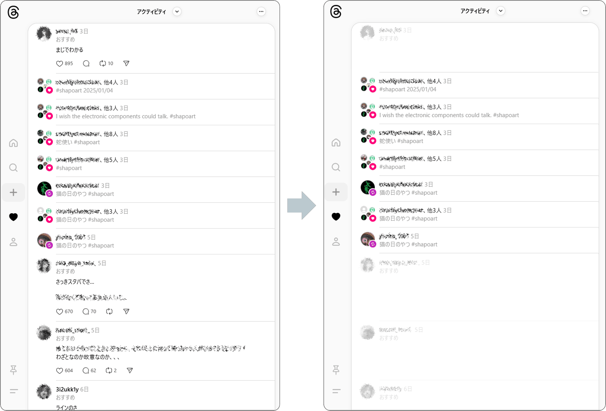

# Threads Fixer

Threads の「おすすめ」「スレッドを開始しました」「久しぶりの投稿」などを目立たなくする UserScript です。

> [!CAUTION]
> **このページを Threads、Instagram、Facebook 等でシェアしないことをお勧めします。**
> Meta 社の AI によって不正な投稿とみなされ、アカウントが制限される可能性があります。

完全に非表示にすると画面のレイアウトが変わって自動的に続きが読み込まれてしまうため薄くするだけにしています。

## インストール方法

1. Chrome または Firefox に以下のいずれかの拡張機能をインストールします。
    - [Tampermonkey](https://www.tampermonkey.net/) (Chrome/Firefox)
    - [Violentmonkey](https://violentmonkey.github.io/) (Firefox)
    - [Greasemonkey](https://addons.mozilla.org/ja/firefox/addon/greasemonkey/) (Firefox)
2. Chrome + Tampermonkey の場合は [デベロッパーモードを有効化](https://www.google.com/search?q=Chrome+%E3%83%87%E3%83%99%E3%83%AD%E3%83%83%E3%83%91%E3%83%BC%E3%83%A2%E3%83%BC%E3%83%89+%E6%9C%89%E5%8A%B9%E5%8C%96) します。
3. [こちらのリンク](https://github.com/shapoco/threads-fixer/raw/refs/heads/main/dist/threads-fixer.user.js) を開き、ユーザースクリプトをインストールします。

## 動かない場合

ページをリロードしてみてください。

別のページから遷移したときに動いてくれないことが多いような気がします。

----
